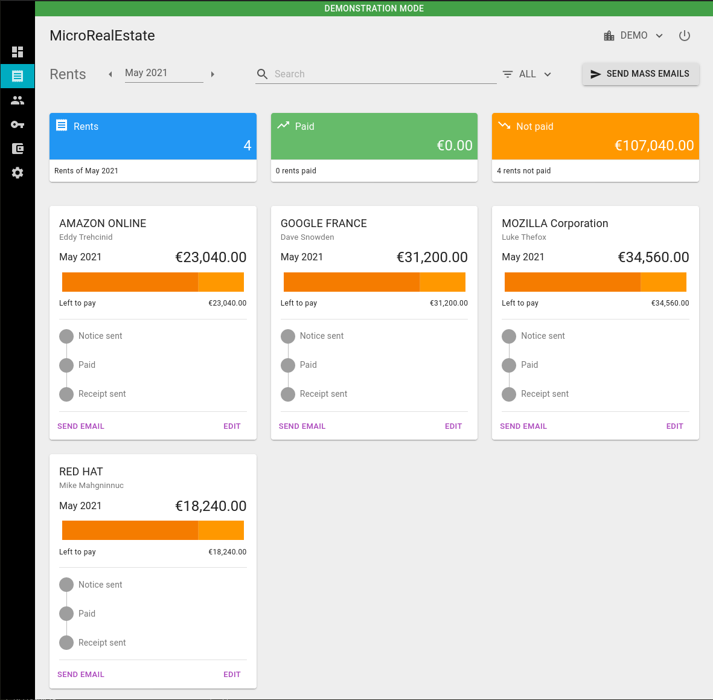
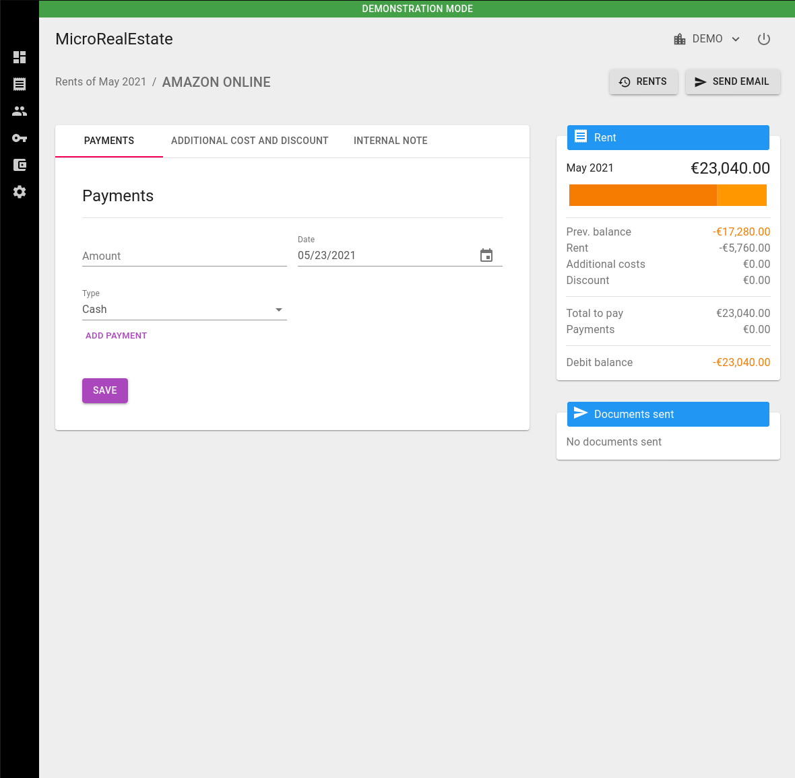
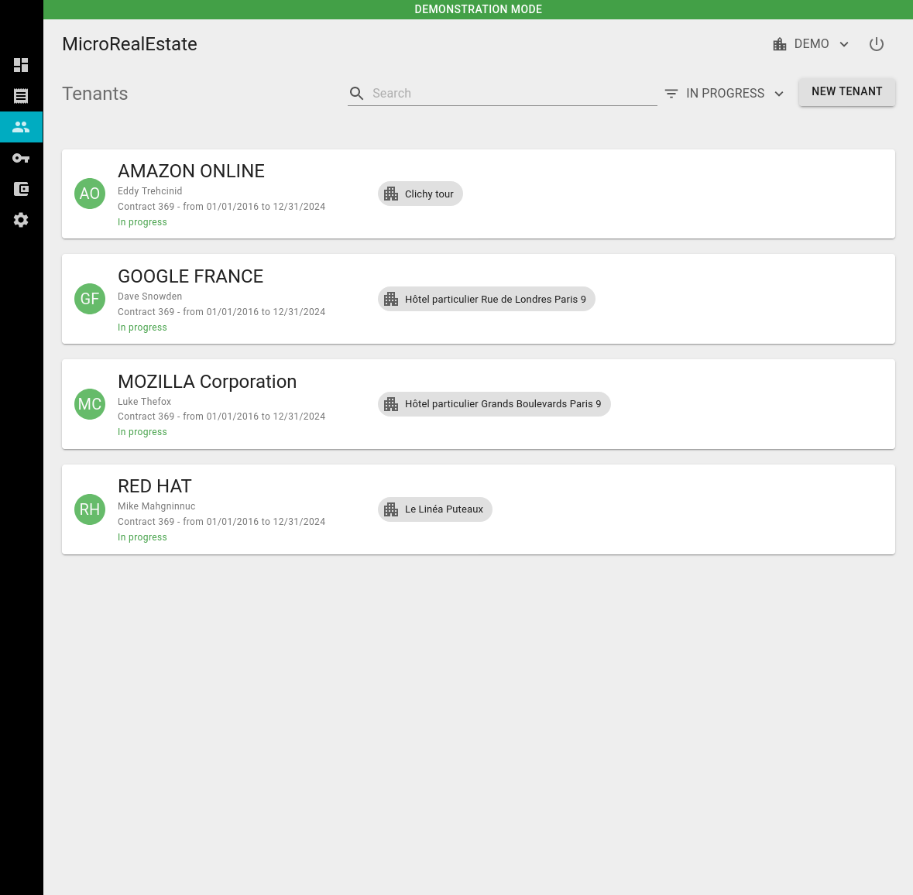
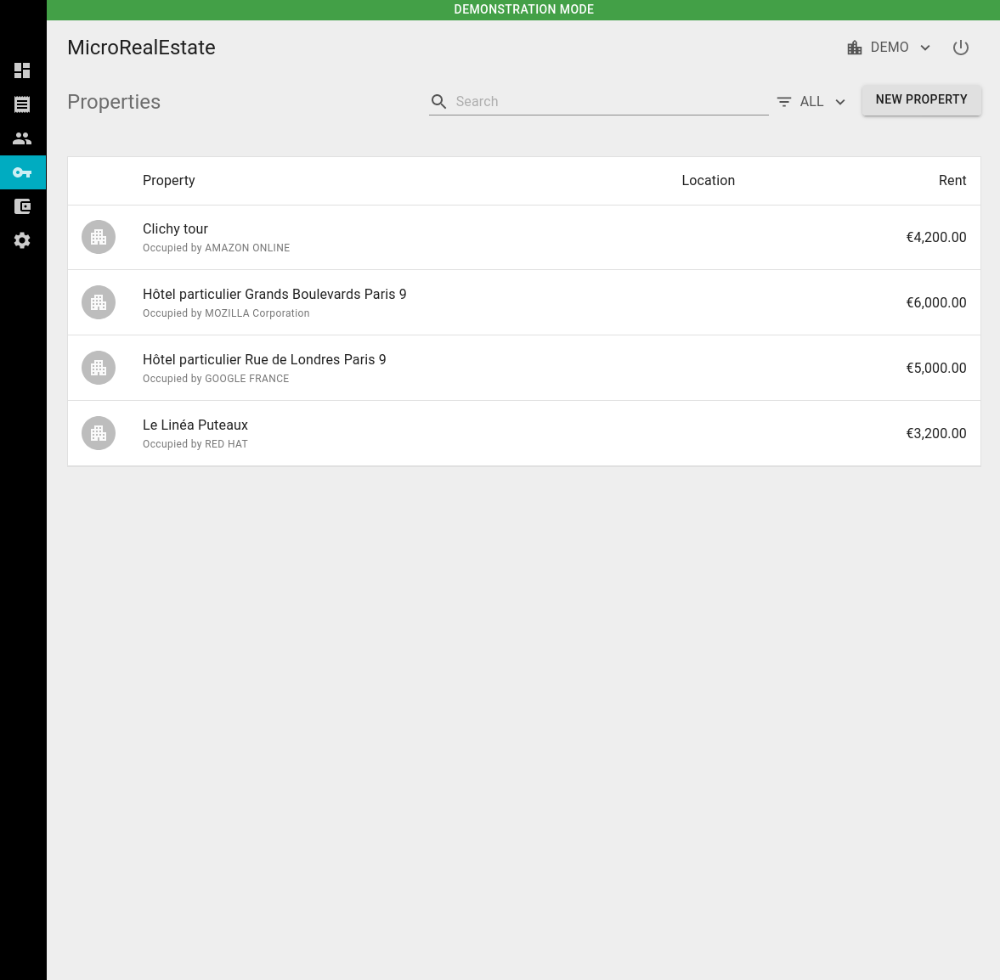
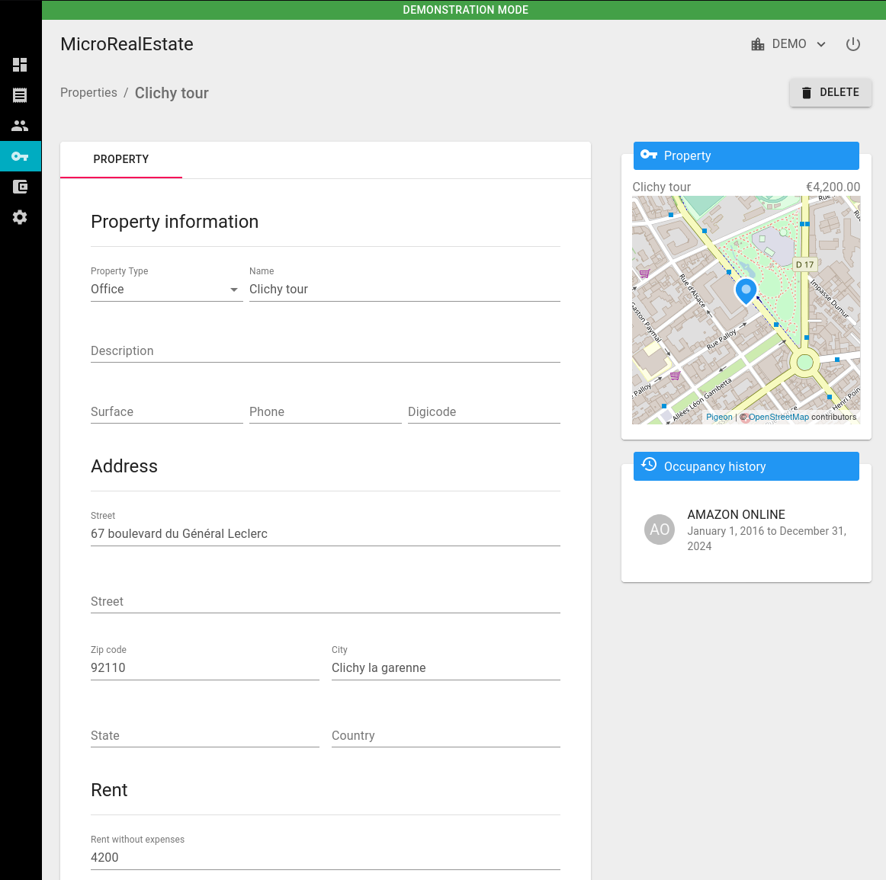
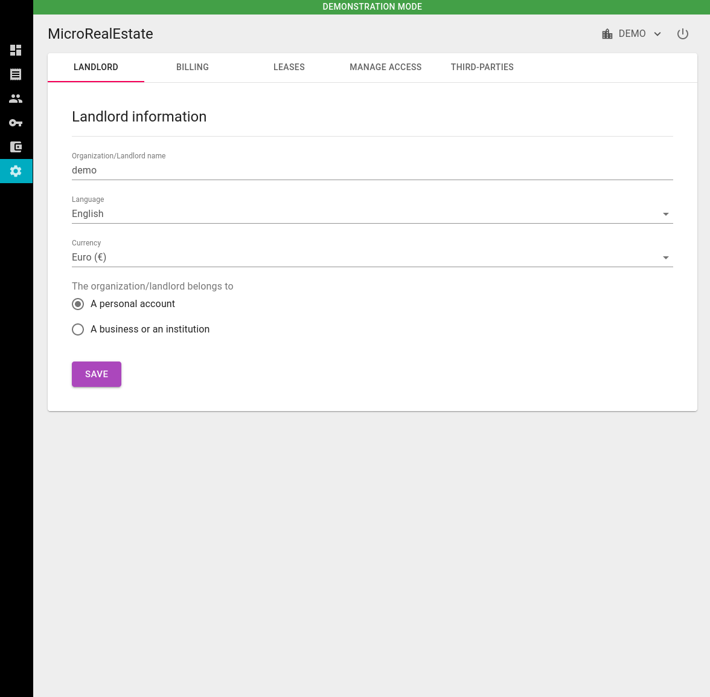
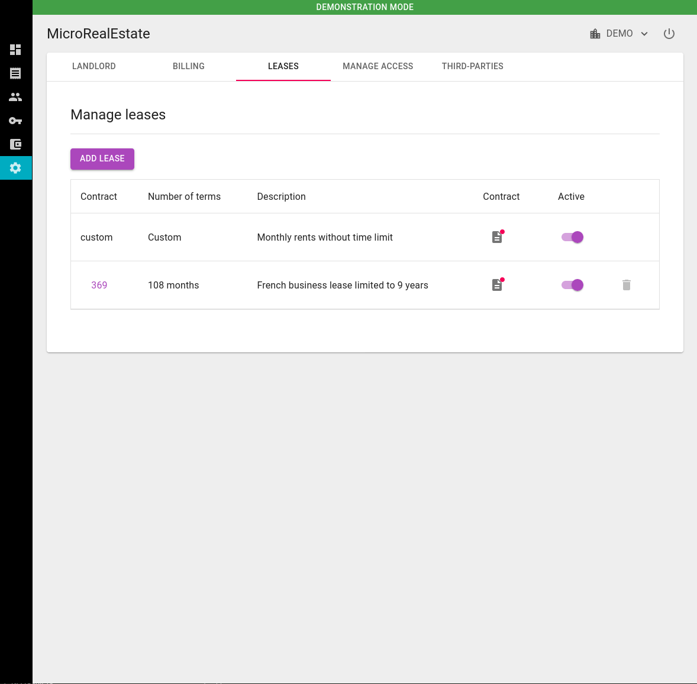
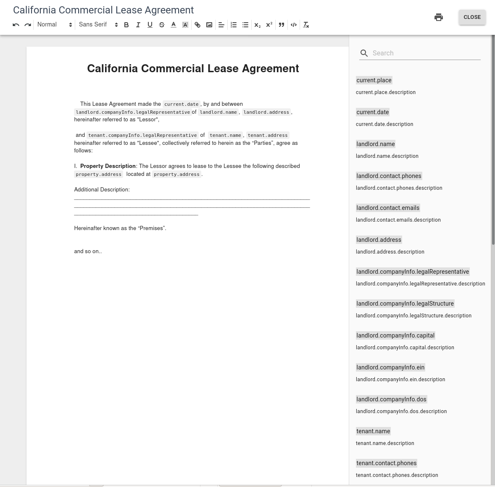
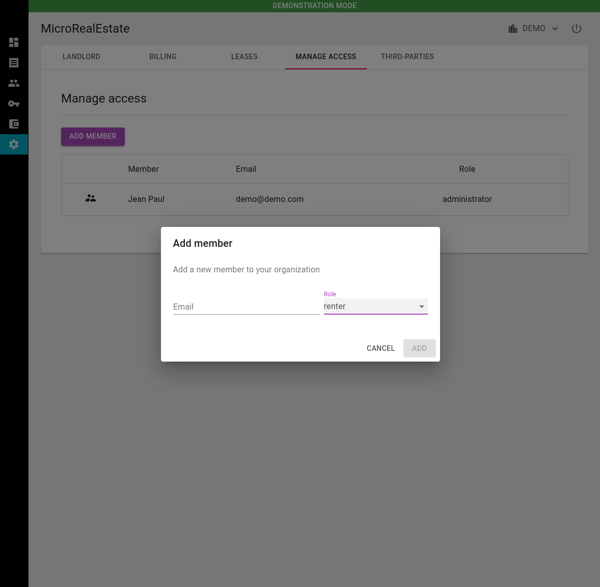

# Bayle

[](https://github.com/maellacour/microrealestate/actions/workflows/ci.yml)

Bayle is a self-hosted application that helps landlords manage their properties, tenants, leases and rent payments — a single place to keep everything organised.

> Bayle began as a fork of [MicroRealEstate](https://github.com/microrealestate/microrealestate) and has since diverged significantly. It remains free and open source under the MIT License. See [Credits & License](#credits--license).

## Key Features

- **Centralized property and tenant information** — store all property specifications, tenant records and contact details in one convenient location.

- **Rent lease creation** — customizable templates that make generating leases straightforward.

- **Rent payment tracking** — a comprehensive system to stay updated on transactions and promptly address overdue payments.

- **Custom document generation** — personalized letters, notices and announcements for clear, consistent correspondence with tenants.

- **Collaboration** — whether you are an independent landlord or manage a business with multiple collaborators, Bayle supports team task coordination.

## Screenshots

|                                                                                                                           |                                                                                                                                   |                                                                                                                                       |
| :-----------------------------------------------------------------------------------------------------------------------: | :-------------------------------------------------------------------------------------------------------------------------------: | :-----------------------------------------------------------------------------------------------------------------------------------: |
|                                                      **Rents page**                                                       |                                                **Send notices, receipt by email**                                                 |                                                            **Pay a rent**                                                             |
|      [](./docs/pictures/rents.png)      | [](./docs/pictures/sendmassemails.png) |          [](./docs/pictures/payment.png)          |
|                                                     **Tenants page**                                                      |                                                        **Tenant details**                                                         |                                                                                                                                       |
|    [](./docs/pictures/tenants.png)    | [](./docs/pictures/tenantcontract.png) |                                                                                                                                       |
|                                                    **Properties page**                                                    |                                                       **Property details**                                                        |                                                                                                                                       |
| [](./docs/pictures/properties.png) |       [](./docs/pictures/property.png)       |                                                                                                                                       |
|                                                     **Landlord page**                                                     |                                                        **Template leases**                                                        |                                                         **Author a contract**                                                         |
|   [](./docs/pictures/landlord.png)   |         [](./docs/pictures/leases.png)         | [](./docs/pictures/contracttemplate.png) |
|                                                        **Members**                                                        |                                                                                                                                   |
|    [](./docs/pictures/members.png)    |                                                                                                                                   |

## Self-host the application

> **Prerequisite**
>
> - [Install Docker and Compose](https://docs.docker.com/compose/install)

### Download the docker-compose.yml file

``` shell
mkdir bayle
cd bayle
curl https://raw.githubusercontent.com/maellacour/microrealestate/main/docker-compose.yml > docker-compose.yml
curl https://raw.githubusercontent.com/maellacour/microrealestate/main/.env.domain > .env
```

Update the secrets and tokens in the `.env` file (at the end of the file).

**🚨 IMPORTANT**

In case you previously ran the application, the secrets, the tokens and the MONGO_URL must be reported from previous .env file to the new one.
Otherwise, the application will not point to the correct database and will not be able to login with the previous credentials.

### Localhost setup

Start the application under localhost:

``` shell
APP_PORT=8080 docker compose --profile local up
```
The application will be available on http://localhost:8080/landlord and http://localhost:8080/tenant.


### Ip setup

Start the application under a custom ip:

``` shell
sudo APP_DOMAIN=x.x.x.x docker compose up
```
x.x.x.x is the ip address of the server.

The application will be available on http://x.x.x.x/landlord and http://x.x.x.x/tenant.

In case you need to use a port number do not pass it in the APP_DOMAIN. You can use the APP_PORT environment variable.


### Domain with https setup

Start the app under a custom domain over https:

``` shell
sudo APP_DOMAIN=app.example.com APP_PROTOCOL=https docker compose up
```

Make sure your DNS records are pointing to the private server. The application will automatically issue the ssl certificate.

The application will be available on https://app.example.com/landlord and https://app.example.com/tenant.


### Backup and restore the data

The backup and restore commands can be executed when the application is running to allow connecting to MongoDB.

#### Backup

In the bayle directory run:

``` shell
docker compose run mongo /usr/bin/mongodump --uri=mongodb://mongo/mredb --gzip --archive=./backup/mredb-$(date +%F_%T).dump
```

Replace "mredb" with the name of your database (see .env file). By default, the database name is "mredb".

The archive file will be placed in the "backup" folder.

#### Restore

In the bayle/backup directory, select an archive file you want to restore.

Then run the restore command:

``` shell
docker compose run mongo /usr/bin/mongorestore --uri=mongodb://mongo/mredb --drop --gzip --archive=./backup/mredb-XXXX.dump 
```

Where mredb-XXXX.dump is the archive file you selected.

Again, replace "mredb" with the name of your database (see .env file). By default, the database name is "mredb".


## Developers

To run the application in development mode, follow the steps outlined in the documentation available [here](./docs/DEVELOPER.md)

## Credits & License

Bayle is a fork of [MicroRealEstate](https://github.com/microrealestate/microrealestate) by Camel Aissani and contributors, originally released under the MIT License. Bayle continues to be distributed under the MIT License, and the original copyright notice is preserved in [LICENSE](./LICENSE).

[MIT License](./LICENSE)
